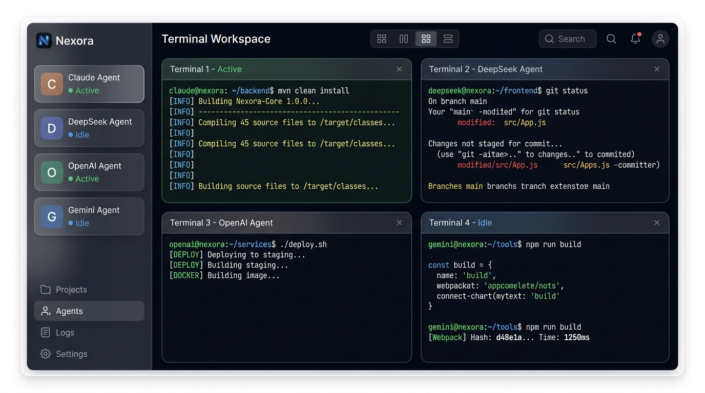
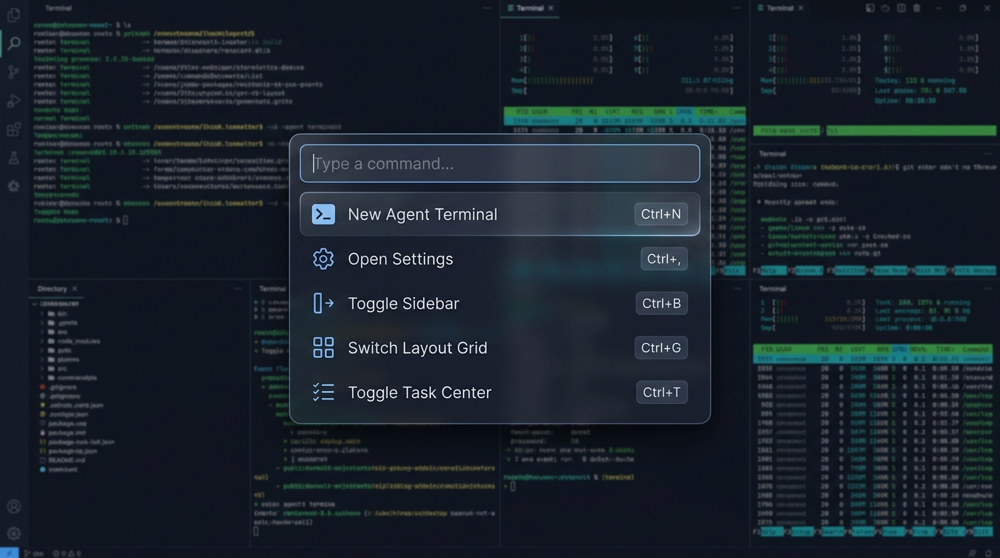
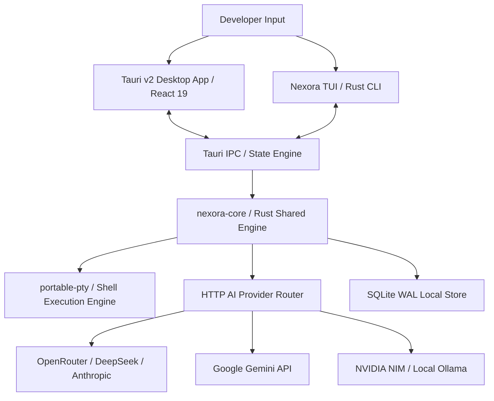

<div align="center">

# Nexora ⚡

**Tier-1 AI-Native Coding Assistant & Multi-Agent Desktop Orchestrator**

[](LICENSE)
[](https://v2.tauri.app/)
[](https://react.dev/)
[](https://www.rust-lang.org/)
[](https://www.typescriptlang.org/)

*An ultra-fast, local-first AI engineering environment designed for seamless pair programming, multi-agent swarm orchestration, and terminal workflow optimization.*

</div>

---

<div align="center">

### 🖥️ Multi-Agent Terminal Workspace



### ⌨️ Universal Command Palette (`Ctrl+K`)



</div>

---

## 🌟 Overview

**Nexora** is a high-craft AI development application built with a **shared Rust core engine**, a **Tauri v2 Desktop GUI**, and a **Rust TUI CLI**. It combines the responsiveness of desktop native tools (like Linear, Cursor, and Raycast) with a multi-provider AI model orchestration layer.



---

## ✨ Features

- 🤖 **Multi-Provider AI Router:** Native support for OpenRouter, DeepSeek, Google Gemini, Anthropic Claude, NVIDIA NIM, and local LLM endpoints.
- ⚡ **Asynchronous Token Streaming:** Real-time token streaming powered by `tokio` and `requestAnimationFrame` token batching.
- 🖥️ **Tauri v2 Desktop GUI:** Glassmorphic UI with GPU layer acceleration, 4px/8px baseline spatial rhythm, and responsive split view docking.
- ⌨️ **Universal Command Palette (`Cmd+K`):** Instant keyboard search over workspaces, agents, commands, and settings drawers.
- 📊 **Local-First SQLite WAL Engine:** Zero-latency session logging, state persistence, and execution changeset reviews.
- 🐚 **Integrated Terminal Multiplexer:** Full `xterm.js` terminal integration with WebGL acceleration, PTY auto-fitting, and drag-to-copy text selection.
- ♿ **WCAG 2.1 AAA Focus Rings:** Keyboard accessibility indicators across all inputs and controls.

---

## 🚀 Quickstart & Development Setup

### Prerequisites

Ensure you have the following installed on your machine:
- **Node.js** v18+ and `npm`
- **Rust** 1.75+ (`rustup`)
- **C++ Build Tools** (Visual Studio Build Tools on Windows)

### 1. Clone & Install Dependencies

```bash
# Clone the repository
git clone https://github.com/gautamcoder235/Nexora.git
cd Nexora

# Install frontend node modules
npm install
```

### 2. Configure Environment Variables

Copy the environment template and insert your AI provider API keys:

```bash
cp .env.example .env
```

### 3. Launch Development Mode

```bash
# Run Vite dev server + Tauri desktop client
npm run dev
```

---

## 🛠️ Project Structure

```
Nexora/
├── core/                # Shared Rust core engine (AI context, provider router)
├── cli/                 # Rust TUI CLI client
├── src-tauri/           # Tauri v2 Desktop backend & Rust PTY multiplexer
├── src/                 # React 19 Frontend UI (Components, Stores, Glassmorphism)
│   ├── components/      # ActivityBar, CommandPalette, TerminalWorkspace, ChatPanel...
│   ├── styles/          # Design tokens, glassmorphism CSS, animations
│   └── stores/          # Zustand orchestration and layout stores
├── docs/                # Architecture specifications & Architectural Decision Records
└── .github/             # GitHub Actions CI workflows & community issue templates
```

---

## 🧪 Build & Lint Checks

Run automated type-checking and Cargo compilation checks:

```bash
# Run TypeScript compilation check
npm run lint

# Run Cargo workspace check across all Rust crates
cargo check --workspace
```

---

## 📖 Documentation & Architecture

Detailed technical documentation is available under [`docs/`](docs/):
- **[Architecture Specification](docs/architecture.md):** Deep dive into the system context, IPC bridge, and buffer managers.
- **[Architectural Decision Records (ADRs)](docs/decisions.md):** Engineering rationale for local-first storage, layout rendering, and command palette ergonomics.

---

## 🤝 Contributing

We welcome contributions from the community! Please read our **[Contributing Guide](CONTRIBUTING.md)** and **[Code of Conduct](CODE_OF_CONDUCT.md)** before opening pull requests or issues.

---

## 📄 License

Nexora is open-source software licensed under the **[MIT License](LICENSE)**.
