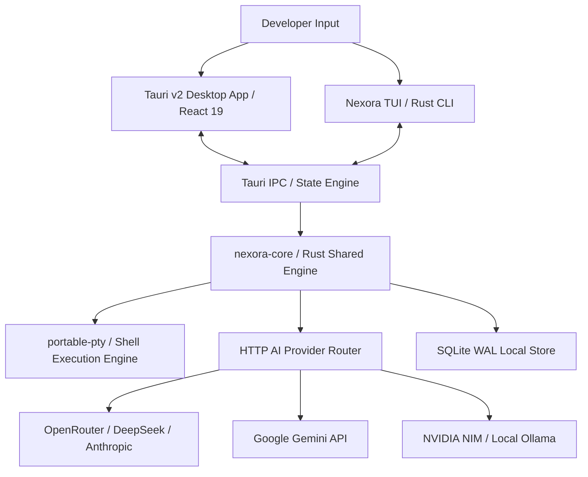

# Nexora System Architecture

Nexora is designed around a high-performance **Local-First Architecture** comprising a shared Rust core engine, a Tauri v2 Desktop client, and an interactive CLI / TUI interface.

## System Components

### 1. `nexora-core` (Rust Shared Engine)
Location: `core/`
- Centralized Rust crate for AI context window building, session management, and HTTP API provider routing.
- High-concurrency token streaming built on `tokio` and `async-stream`.

### 2. Desktop Application Client (`src-tauri` + `src/`)
Location: `src-tauri/` and `src/`
- **Frontend:** React 19, TypeScript, Tailwind CSS v4, xterm.js, `@xyflow/react`.
- **Backend:** Tauri v2 application host with native OS window controls, system tray, and `portable-pty` shell multiplexing.
- **Glassmorphism UI Engine:** Custom GPU-composited glassmorphic design token system with 4px/8px baseline spatial rhythm.

### 3. Command Line Interface (`cli/`)
Location: `cli/`
- High-performance Rust TUI client communicating directly with the Desktop orchestrator engine over IPC.

### 4. Data Layer & Storage
- **Database:** SQLite in WAL (Write-Ahead Logging) mode via `rusqlite` for zero-latency local state persistence.
- **Buffer Manager:** Thread-safe sequence buffer for high-throughput terminal output streaming up to 120 FPS.
