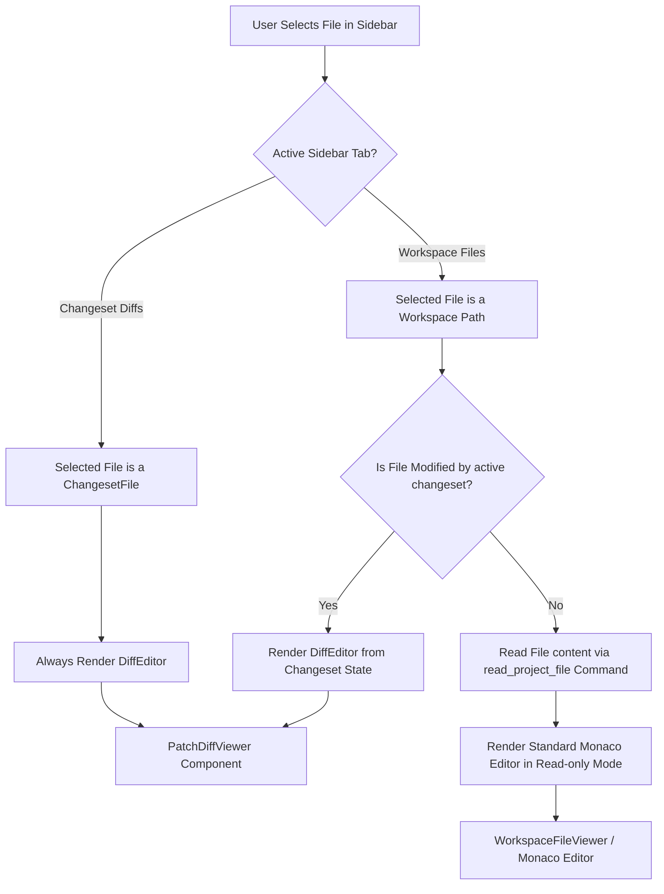

# Nexora Project File Explorer Extension — Design Specification

This document details the design specification for integrating a general **Project File Explorer** into the **Agent Review Center** of Nexora. It includes UI/UX layouts, state management, backend Tauri commands, Monaco Editor integration, and a complete code modification spec.

---

## 1. Architectural Overview & Data Flow

Currently, the Agent Review Center is designed purely around **Changeset Diffs** proposal analysis. Adding a Project File Explorer requires a hybrid UI that lets the user inspect the entire workspace folder tree alongside the proposed edits.

The following Mermaid diagram outlines the new conditional rendering architecture and data flow:



---

## 2. Backend Tauri Changes (Tauri/Rust)

Since the frontend needs to render a directory tree dynamically without loading all node modules or huge git tracking histories, we will introduce a performance-optimized **lazy-loading folder API** in Rust.

### Rust Struct & Tauri Command
In `src-tauri/src/lib.rs`, add the following structures and the `list_directory` command:

```rust
#[derive(serde::Serialize, serde::Deserialize)]
pub struct FileNode {
    pub name: String,
    pub path: String, // Absolute path
    pub is_dir: bool,
    pub size: Option<u64>,
}

#[tauri::command]
pub fn list_directory(dir_path: String) -> Result<Vec<FileNode>, String> {
    let path = std::path::Path::new(&dir_path);
    if !path.exists() {
        return Err("Directory does not exist".to_string());
    }
    if !path.is_dir() {
        return Err("Path is not a directory".to_string());
    }

    let mut entries = Vec::new();
    let read_dir = std::fs::read_dir(path).map_err(|e| e.to_string())?;

    for entry in read_dir {
        let entry = entry.map_err(|e| e.to_string())?;
        let entry_path = entry.path();
        let file_name = entry.file_name().to_string_lossy().to_string();

        // 🚀 CRITICAL IGNORE RULE: Filter system/dependency dirs for maximum performance
        if file_name == ".git" || file_name == "node_modules" || file_name == "target" || file_name == "dist" || file_name == "build" {
            continue;
        }

        let metadata = entry.metadata().map_err(|e| e.to_string())?;
        let is_dir = metadata.is_dir();
        let size = if is_dir { None } else { Some(metadata.len()) };

        entries.push(FileNode {
            name: file_name,
            path: entry_path.to_string_lossy().to_string(),
            is_dir,
            size,
        });
    }

    // Sort: directories first, then files alphabetically (case-insensitive)
    entries.sort_by(|a, b| {
        if a.is_dir && !b.is_dir {
            std::cmp::Ordering::Less
        } else if !a.is_dir && b.is_dir {
            std::cmp::Ordering::Greater
        } else {
            a.name.to_lowercase().cmp(&b.name.to_lowercase())
        }
    });

    Ok(entries)
}
```

### Handler Registration
Register the command in the main builder block inside `src-tauri/src/lib.rs`:

```diff
         .invoke_handler(tauri::generate_handler![
             spawn_pty,
             write_pty,
             resize_pty,
             kill_pty,
             kill_all_ptys,
             select_folder,
             save_config,
             load_config,
             check_cli_tool,
             read_project_file,
             write_project_file,
             set_terminal_visibility,
             get_terminal_metrics,
             get_system_metrics,
+            list_directory,
```

---

## 3. Frontend Selection & Loading Logic

We unify selection state into a single selected file path string: `selectedFilePath: string | null`. 

### State Additions
Inside `AgentReviewCenter.tsx`, add the following state hooks:
```typescript
const [activeTab, setActiveTab] = useState<'changeset' | 'workspace'>('changeset');
const [selectedFilePath, setSelectedFilePath] = useState<string | null>(null);

// Tree Expand/Collapse state (stores absolute paths of expanded dirs)
const [expandedDirs, setExpandedDirs] = useState<Set<string>>(new Set());

// Cache of loaded directories to prevent redundant Tauri RPC requests
const [dirContents, setDirContents] = useState<Record<string, FileNode[]>>({});

// Content buffer for files opened directly from the project explorer
const [workspaceFileContent, setWorkspaceFileContent] = useState<string>('');
const [isFileLoading, setIsFileLoading] = useState<boolean>(false);
```

### File Reading Effect
When the selected file path changes, check if it's a modified file. If it is **not**, fetch its contents from the workspace folder:

```typescript
useEffect(() => {
  if (!selectedFilePath) return;
  
  const isModified = activeChangeset?.files.some(f => f.path === selectedFilePath);
  if (isModified) {
    // Content is already in memory via changeset store
    return;
  }
  
  const loadFileContent = async () => {
    setIsFileLoading(true);
    try {
      const absolutePath = `${repoPath}/${selectedFilePath}`;
      const content = await invoke<string>('read_project_file', { path: absolutePath });
      setWorkspaceFileContent(content);
    } catch (err) {
      console.error("Error reading project file:", err);
      setWorkspaceFileContent(`// Error loading file: ${err}`);
    } finally {
      setIsFileLoading(false);
    }
  };
  
  loadFileContent();
}, [selectedFilePath, activeChangeset, repoPath]);
```

---

## 4. Left Sidebar Layout & Styling Specs

We introduce the sidebar toggle below the changeset selection dropdown, matching Nexora's high-contrast dark theme and amber accents.

### Toggle Layout
```typescript
<div className="px-3 pb-3 border-b border-zinc-800 flex gap-1.5 shrink-0">
  <button
    onClick={() => setActiveTab('changeset')}
    className={`flex-1 text-center py-1.5 rounded text-[11px] font-semibold transition-all cursor-pointer ${
      activeTab === 'changeset'
        ? 'bg-amber-500/10 border border-amber-500/30 text-amber-500 font-bold'
        : 'text-zinc-400 hover:text-zinc-200 bg-transparent border border-transparent'
    }`}
  >
    Changeset Diffs
  </button>
  <button
    onClick={() => setActiveTab('workspace')}
    className={`flex-1 text-center py-1.5 rounded text-[11px] font-semibold transition-all cursor-pointer ${
      activeTab === 'workspace'
        ? 'bg-amber-500/10 border border-amber-500/30 text-amber-500 font-bold'
        : 'text-zinc-400 hover:text-zinc-200 bg-transparent border border-transparent'
    }`}
  >
    Workspace Files
  </button>
</div>
```

---

## 5. Tree Directory Renderer Component

The Project Explorer tree rendering must indent child nodes correctly and use VSCode-like file/folder styles:

```typescript
import { 
  ChevronRight, 
  ChevronDown, 
  Folder, 
  FolderOpen, 
  File 
} from 'lucide-react';

interface DirectoryTreeProps {
  dirPath: string; // Absolute path
  depth: number;
  repoPath: string;
  selectedFilePath: string | null;
  onFileSelect: (path: string) => void;
  expandedDirs: Set<string>;
  toggleDir: (path: string) => void;
  dirContents: Record<string, FileNode[]>;
}

export function DirectoryTree({
  dirPath,
  depth,
  repoPath,
  selectedFilePath,
  onFileSelect,
  expandedDirs,
  toggleDir,
  dirContents
}: DirectoryTreeProps) {
  const children = dirContents[dirPath] || [];

  const getRelativePath = (absolutePath: string) => {
    return absolutePath
      .replace(repoPath.endsWith('/') || repoPath.endsWith('\\') ? repoPath : `${repoPath}/`, '')
      .replace(/\\/g, '/');
  };

  return (
    <div className="flex flex-col select-none">
      {children.map((node) => {
        const isExpanded = expandedDirs.has(node.path);
        const relPath = getRelativePath(node.path);
        const isSelected = selectedFilePath === relPath;

        if (node.is_dir) {
          return (
            <div key={node.path}>
              <button
                onClick={() => toggleDir(node.path)}
                className="w-full text-left text-[12px] font-mono py-1 px-2 hover:bg-zinc-900/40 flex items-center gap-1.5 transition-colors text-zinc-300 cursor-pointer"
                style={{ paddingLeft: `${depth * 12 + 8}px` }}
              >
                {isExpanded ? <ChevronDown size={12} className="text-zinc-500" /> : <ChevronRight size={12} className="text-zinc-500" />}
                {isExpanded ? (
                  <FolderOpen size={13} className="text-amber-500/80 fill-amber-500/10" />
                ) : (
                  <Folder size={13} className="text-amber-500/80 fill-amber-500/10" />
                )}
                <span className="truncate">{node.name}</span>
              </button>
              {isExpanded && (
                <DirectoryTree
                  dirPath={node.path}
                  depth={depth + 1}
                  repoPath={repoPath}
                  selectedFilePath={selectedFilePath}
                  onFileSelect={onFileSelect}
                  expandedDirs={expandedDirs}
                  toggleDir={toggleDir}
                  dirContents={dirContents}
                />
              )}
            </div>
          );
        } else {
          return (
            <button
              key={node.path}
              onClick={() => onFileSelect(relPath)}
              className={`w-full text-left text-[12px] font-mono py-1 px-2 flex items-center gap-1.5 transition-colors cursor-pointer ${
                isSelected 
                  ? 'bg-amber-500/10 text-amber-400 font-semibold border-l-2 border-amber-500' 
                  : 'text-zinc-400 hover:bg-zinc-900/40'
              }`}
              style={{ paddingLeft: `${depth * 12 + 20}px` }} // Aligns nicely with parent chevron
            >
              <File size={13} className="text-zinc-500" />
              <span className="truncate">{node.name}</span>
            </button>
          );
        }
      })}
    </div>
  );
}
```

---

## 6. Monaco Editor Switcher Component

Instead of always rendering `PatchDiffViewer`, the editor panel decides whether to render a diff or a single file:

```typescript
import Editor from '@monaco-editor/react';

// ... Inside AgentReviewCenter Editor Area ...

const changesetFile = activeChangeset?.files.find(f => f.path === selectedFilePath);

{/* Monaco Viewport */}
<div className="flex-grow overflow-hidden p-6 bg-[#09090b]">
  {selectedFilePath ? (
    changesetFile ? (
      <PatchDiffViewer
        originalContent={changesetFile.old_content}
        proposedContent={changesetFile.new_content}
        filePath={changesetFile.path}
      />
    ) : isFileLoading ? (
      <div className="flex h-full w-full items-center justify-center border border-zinc-800 rounded-lg text-zinc-500 font-mono text-xs">
        <div className="animate-spin rounded-full h-5 w-5 border-t-2 border-b-2 border-amber-500 mr-2"></div>
        Loading file content...
      </div>
    ) : (
      <div className="solid-dark-content border border-border-glass rounded-lg overflow-hidden flex flex-col h-full bg-[#050507]">
        <div className="bg-bg-secondary/40 border-b border-border-glass px-4 py-3 flex justify-between items-center select-none">
          <div className="flex items-center gap-3">
            <span className="font-mono text-sm text-zinc-300">{selectedFilePath}</span>
            <span className="text-[10px] text-zinc-500 font-mono bg-[#101014] px-2 py-0.5 rounded border border-border-glass uppercase">
              {getLanguageFromPath(selectedFilePath)} (Read-only)
            </span>
          </div>
        </div>
        <div className="flex-grow w-full bg-[#050507] min-h-0 relative">
          <Editor
            height="100%"
            language={getLanguageFromPath(selectedFilePath)}
            value={workspaceFileContent}
            theme="vs-dark"
            options={{
              readOnly: true,
              minimap: { enabled: true },
              fontSize: 12,
              fontFamily: 'courier-new, courier, monospace',
              lineNumbers: 'on',
              folding: true,
              scrollBeyondLastLine: false,
              scrollbar: {
                vertical: 'visible',
                horizontal: 'visible',
                useShadows: false,
                verticalScrollbarSize: 10,
                horizontalScrollbarSize: 10
              }
            }}
          />
        </div>
      </div>
    )
  ) : (
    <div className="flex h-full w-full items-center justify-center border border-zinc-800 rounded-lg text-zinc-500 font-mono text-xs">
      Select a file from the explorer sidebar to view.
    </div>
  )}
</div>
```
